# MediSystemsPro
MediSystemsPro is a comprehensive hospital management system built using the MEN (MongoDB, Express.js, and Node.js) stack. It provides a user-friendly interface for effectively managing patients and doctors with full CRUD (Create, Read, Update, Delete) functionality and seamless navigation through various RESTful routes. This application simplifies the process of tracking and monitoring patients within a hospital setting, offering a streamlined and efficient experience for healthcare professionals.

**Screenshot of app**
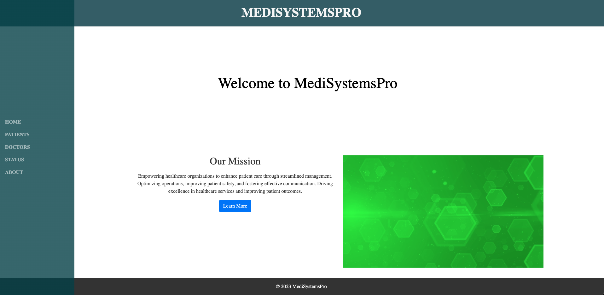
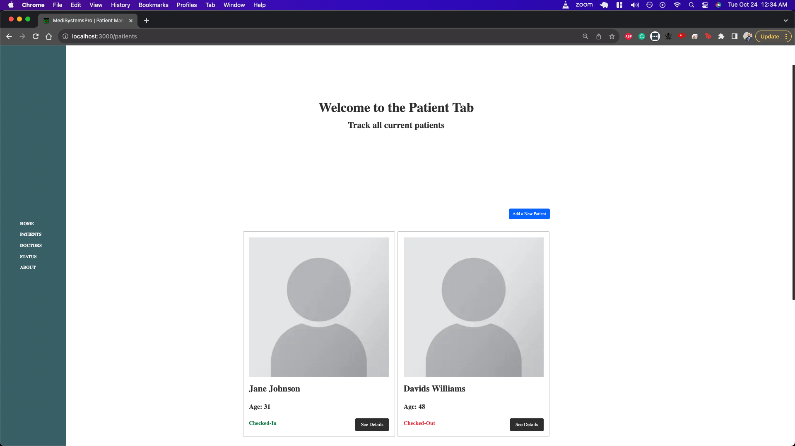
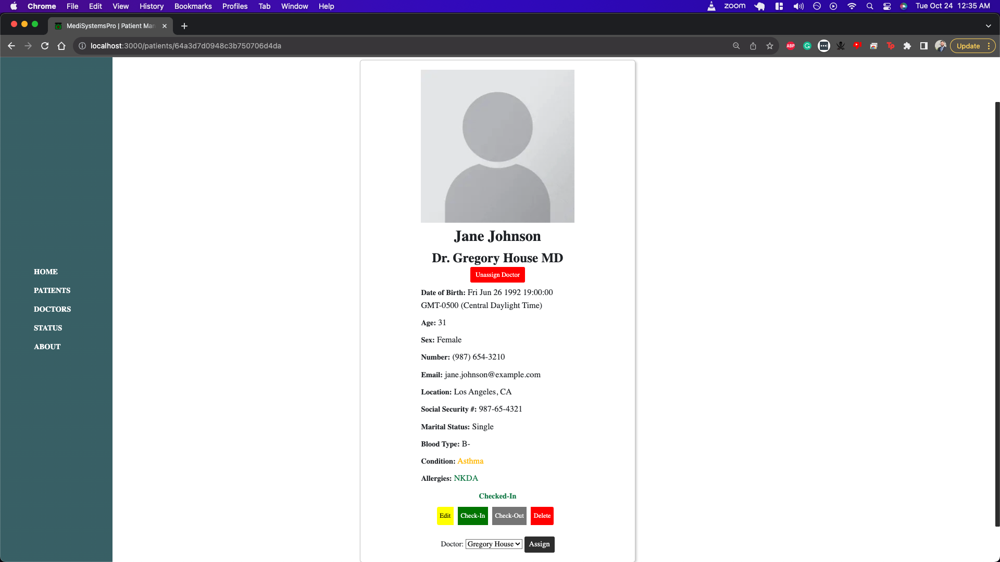
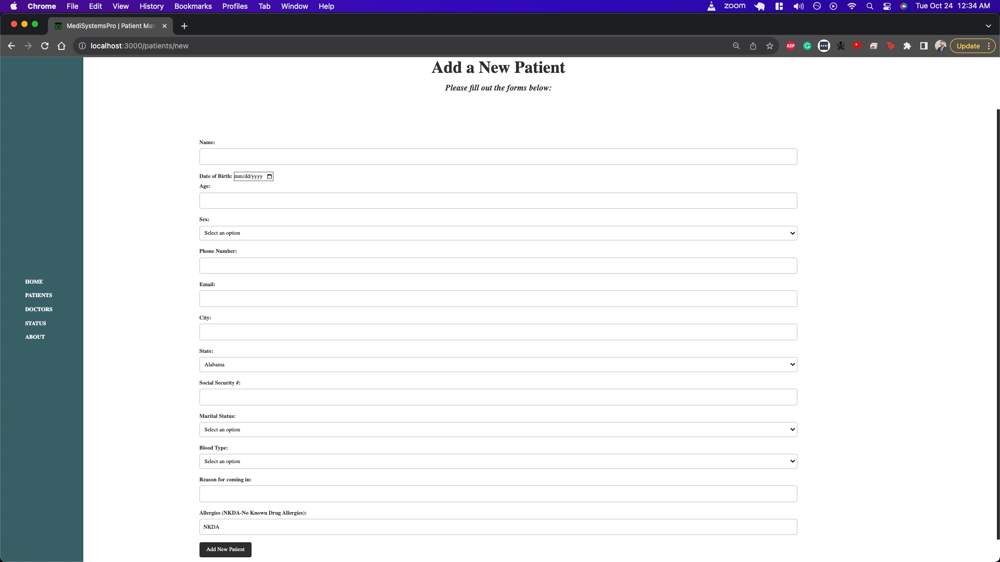
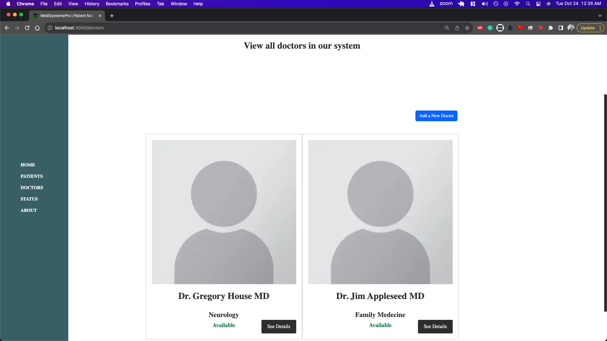
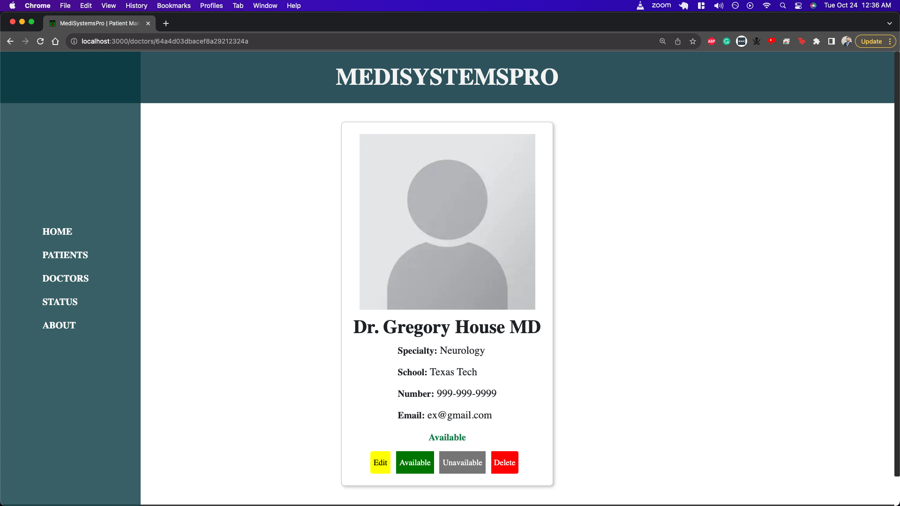
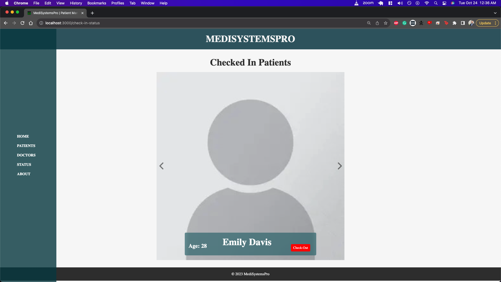
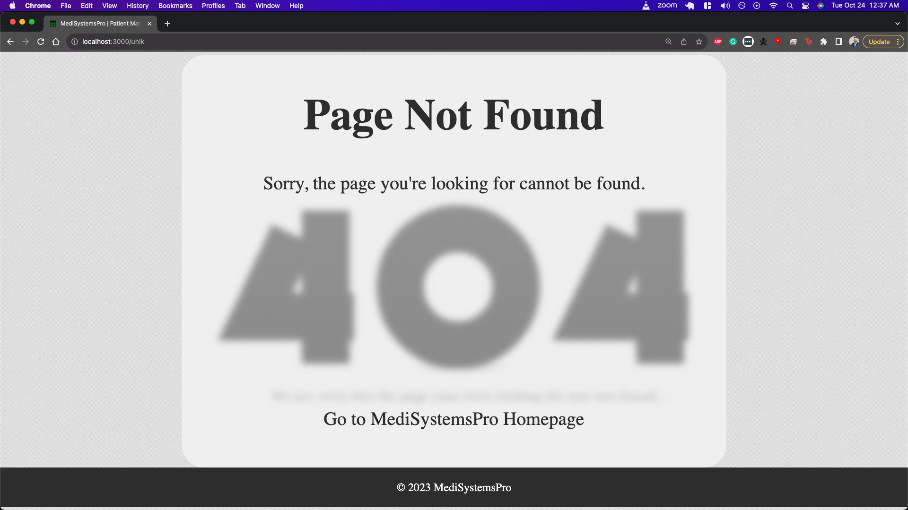

# Technologies Used
The following technologies were utilized in the development of MediSystemsPro:

- MongoDB: A NoSQL database for storing and managing data.
- Express.js: A flexible and minimalistic web application framework for Node.js.
- Node.js: A JavaScript runtime environment for executing server-side code.
- Bootstrap 5: A popular CSS framework for building responsive and modern web applications.
- Font Awesome Icons: A comprehensive library of icons for adding visual enhancements to the application.
- Visual Studio Code: A lightweight and powerful integrated development environment (IDE) for writing and editing code.
- Heroku: A cloud platform for deploying and hosting web applications.

# Installation Instructions

<ol>
    <li>Clone the repository by running:
        <pre><code>git clone https://github.com/omer-abdul-hameed/MediSystemsPro.git</code></pre>
    </li>
    <li>Navigate to the project directory:
        <pre><code>cd MediSystemsPro</code></pre>
    </li>
    <li>Initialize NPM by running:
        <pre><code>npm init -y</code></pre>
    </li>
    <li>Install required dependencies by running:
        <pre><code>npm i express ejs mongoose dotenv livereload connect-livereload</code></pre>
        
You'll notice that we installed two new dependencies, <code>livereload</code> and <code>connect-livereload</code>. These will allow our application to auto-refresh the browser every time <code>nodemon</code> reloads.

    </li>
    <li>Create a `.env` file in the root directory of your project and add the necessary environment variables, such as:
        <pre><code>PORT=3000
MONGODB_URI=mongodb://localhost/medisystemspro</code></pre>
    </li>
    <li>Start the application by running:
        <pre><code>npm run dev</code></pre>
    </li>
    <li>Open your browser and visit `http://localhost:3000` to access the application.</li>
    <li>Visit <a href="https://medisystemspro-46edbfd6b8f3.herokuapp.com/home"> Live Site</a> Instead !</li>
</ol>

# User Stories

1. As a doctor, I want the patient check-in management system to allow me to view the real-time status of incoming patients, so that I can efficiently plan and prioritize my appointments based on their urgency and medical needs.

2. As a patient, I want the check-in management system to provide a user-friendly interface that allows me to complete the check-in process quickly and easily so that I can minimize the time spent in the waiting area and have a more convenient experience during my hospital visit.

3. As a hospital admin, I want the patient check-in management system to generate comprehensive reports and analytics on check-in data, including average wait times, peak hours, and patient flow so that I can identify bottlenecks, optimize resource allocation, and improve the overall efficiency of our hospital operations.

**Wireframes**
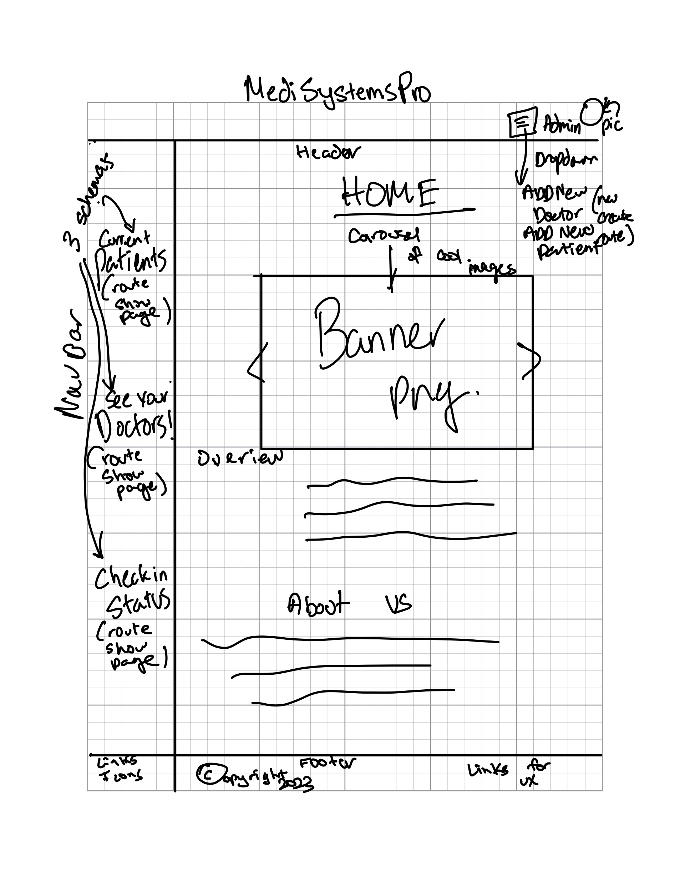
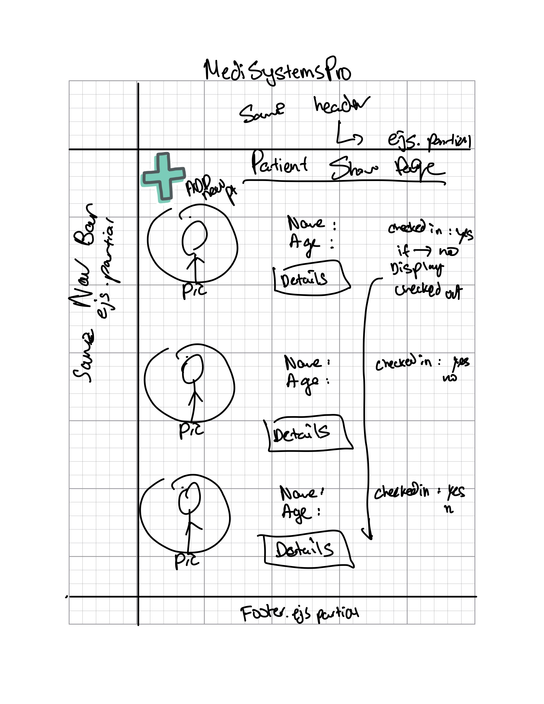
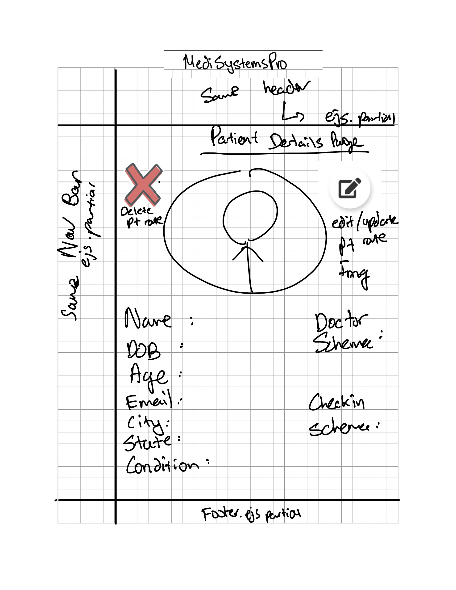
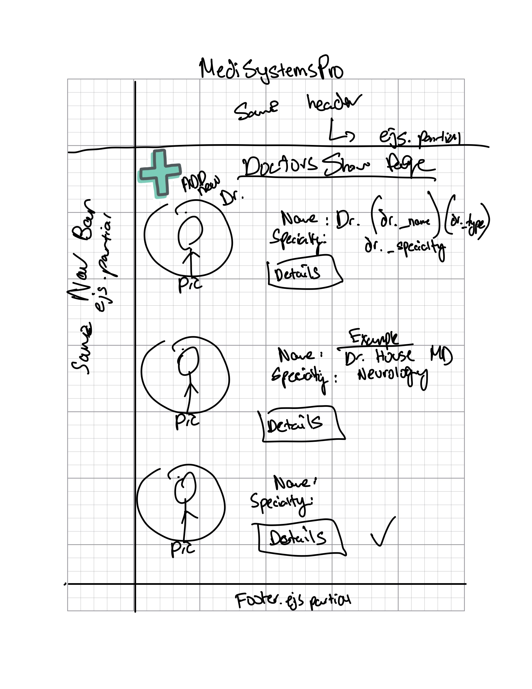
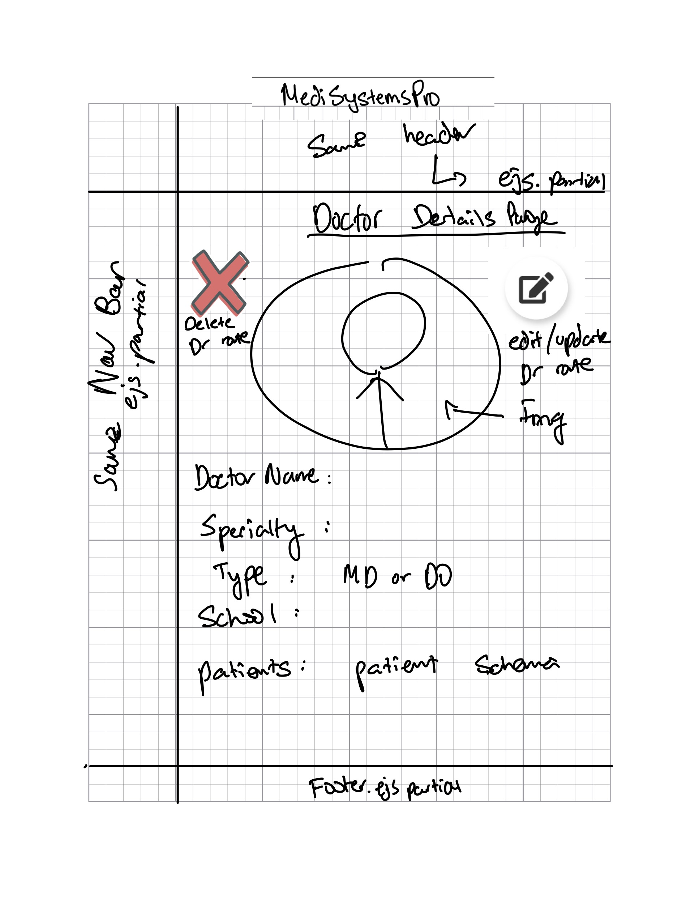
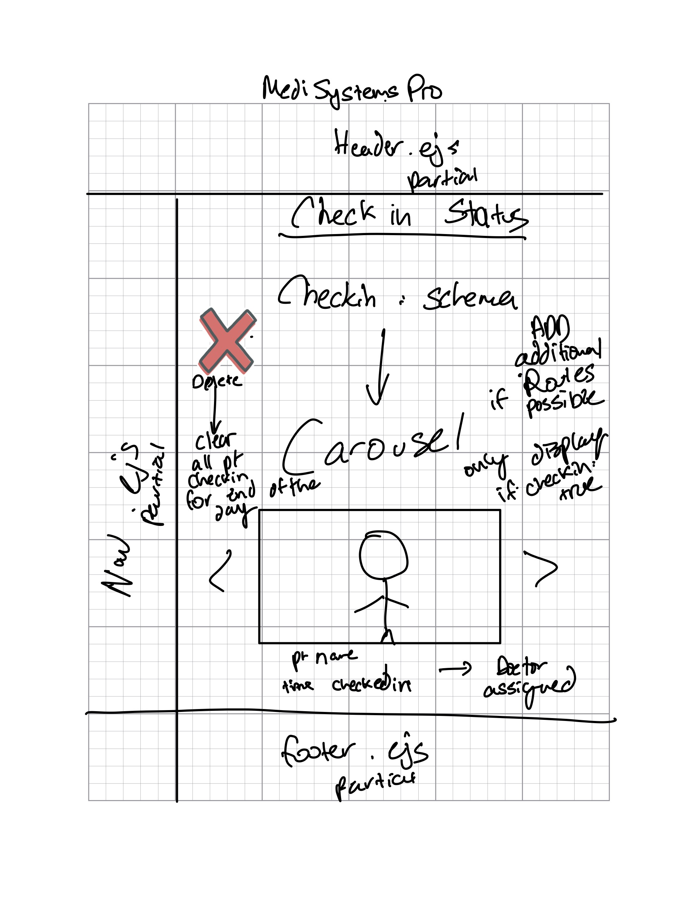

**ERD Diagram**
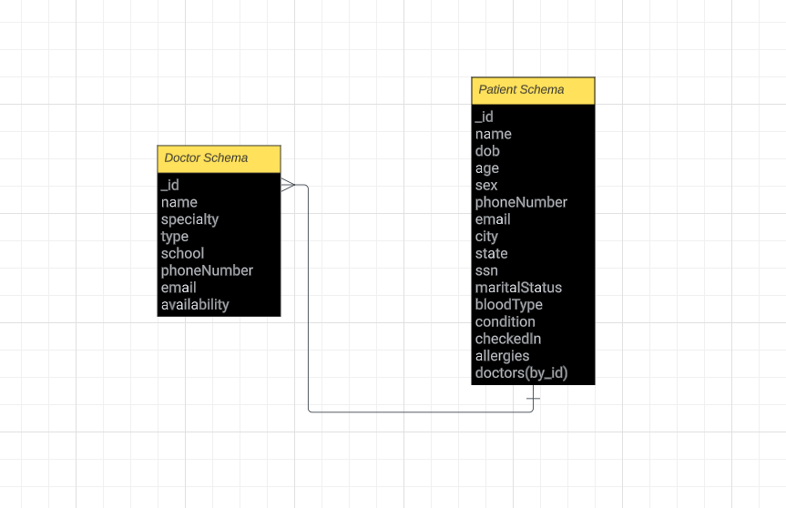

## Route Table

| URL                      	| REST ROUTE 	| HTTP Verb 	| CRUD Action   	| View.ejs            	|
|--------------------------	|------------	|-----------	|---------------	|---------------------	|
| /                        	|            	| GET       	| read          	| home.ejs            	|
| /patients                	| index      	| GET       	| read          	| patient-index.ejs   	|
| /patients/:id            	| show       	| GET       	| read          	| patient-details.ejs 	|
| /patients/new            	| new        	| GET       	|               	| new-patient.ejs     	|
| /patients                	| create     	| POST      	| create        	|                     	|
| /patients/:id/edit       	| edit       	| GET       	| read          	| edit-patient.ejs    	|
| /patients/:id            	| update     	| PATCH/PUT 	| update        	|                     	|
| /patients/:id/checkin    	| update     	| PATCH/PUT 	| update        	|                     	|
| /patients/:id/checkout   	| update     	| PATCH/PUT 	| update        	|                     	|
| /patients/:id            	| destroy    	| DELETE    	| delete        	|                     	|
| /doctors                 	| index      	| GET       	| read          	| doctor-index.ejs    	|
| /doctors/:id             	| show       	| GET       	| read          	| doctor-details.ejs  	|
| /doctors/new             	| new        	| GET       	|               	| new-doctor.ejs      	|
| /doctors                 	| create     	| POST      	| create        	|                     	|
| /doctors/:id/edit        	| edit       	| GET       	| read          	| edit-doctor.ejs     	|
| /doctors/:id             	| update     	| PATCH/PUT 	| update        	|                     	|
| /doctors/:id/available   	| update     	| PATCH/PUT 	| update        	|                     	|
| /doctors/:id/unavailable 	| update     	| PATCH/PUT 	| update        	|                     	|
| /doctors/:id             	| destroy    	| DELETE    	| delete        	|                     	|
| /check-in-status         	| index      	| GET       	| read          	| check-in-status.ejs 	|
| /about                   	|            	| GET       	|               	| about.ejs           	|
| /seed                    	|            	| GET       	| delete&create 	|                     	|
| /*                       	|            	| GET       	|               	| 404.ejs             	|

## Major Hurdles

One of the major hurdles encountered during the development of the project was connecting the Doctor Schema to the Patient Schema without fully embedding the doctor into the patient. The goal was to assign doctors to patients while still allowing the creation of doctors without immediately associating them with a patient ID.

## Unsolved Problems

There are a couple of unsolved problems that need to be addressed. Firstly, the application requires better and consistent styling. The CSS currently lacks responsiveness, resulting in inconsistent page layouts.

Additionally, there was an unsuccessful attempt to display all the patients associated with a doctor on the details page. This functionality needs to be fixed in future updates.

